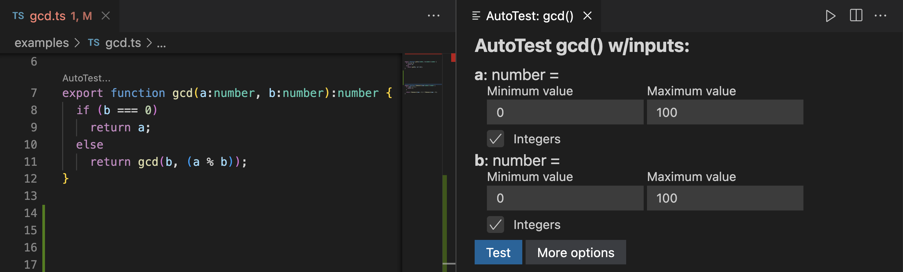

# Tutorial: AutoTest

AutoTest is a useful tool for quickly unit testing Typescript programs.

## How to use AutoTest:

1. Click the `AutoTest` button above any function.
2. _(Optional)_ Adapt the range parameters if needed
3. Click `Test`
4. Inspect the results

We will walk through each step in the tutorial below.

## How to Read an AutoTest screen

Please examine the AutoTest screen below.



Can you find the key parts of the screen?

In the left pane:

1. The Typescript function being tested (`gcd`)
2. The `AutoTest` button just above `gcd`'s function signature

In the right pane:

1. The range of input values for `a` (`0` to `100`)
2. The range of input values for `b` (`0` to `100`)
3. The type of number (`integer`s or floats)
4. The `More options` button
5. The `Test` button

## How AutoTest works

When started, AutoTest examines the function under test and determines reasonable testing defaults, which the tester can adapt if needed.

By clicking `Test`, AutoTest samples the input ranges and generates a suite of tests that exercise the input ranges, similar to a fuzzer. If any of these tests fail, AutoTest informs the tester.

AutoTest detects these common errors during testing:

1. Null, undefined, NaN, or Infinity outputs
2. Non-termination within a reasonable amount of time
3. Runtime exceptions (e.g., array out of bounds)

## The function we are testing

The source code for `gcd()` may be found in `tutorial.ts` within the same `tutorials` folder. It looks like this?

```Typescript
function gcd(a:number, b:number):number {
  if (b === 0)
    return a;
  else
    return gcd(b, (a % b));
}
```

## Exercise 1

Open the `tutorial.ts` file in this tutorial folder.

Click the `AutoTest` button above `gcd`'s function signature. This starts AutoTest in a new window to the right.

Click the `Test` button in the new window.

The test results are shown below and are organized according to which tests passed and which ones failed.

Review the results. Did any tests fail? How can you tell they failed?

## Exercise 2

Inside the AutoTest window, change some of the parameters such as `Minimum` and `Maximum` values and click `Test` to observe how your choices change the inputs to the function.

Click the `More options` button. Change the number of tests or the maximum runtime. Click `Test` to observe how the number of tests and the tool's runtime changes.

## Conclusion

Unit testing with AutoTest is as simple as clicking `AutoTest` and then clicking `Test`.

> **Tip**: When encountering a new function to test, immediately start AutoTest and run it with the default settings to get familiar with the function under test.

There are many advanced AutoTest features you may explore in the documentation, but what you have learned is all you need for the tasks we will be performing today.
