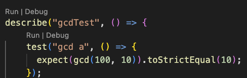

# Jest Runner tutorial

> Jest is a useful tool for unit testing Typescript programs. Once you define your test cases, it's easy to run tests by clicking the `Run` button above any test.



Open the `tutorial.test.ts` file in this tutorial folder.  Clicking the `Run` button above the test will automatically run your tests.

A sample test in Jest looks like the following.  Please take a moment to read and familiarize yourself with it.

```Typescript
  test("function name", () => {
    expect(funcTest(args)) //Pass in arguments to function under test
    .toStrictEqual(expVal); // Compare expected with actual value
  });
```

`tutorial.ts` is the file that has the implementation of the Euclidean algorithm tested in `tutotial.test.ts`. 

```Typescript
function gcd(a:number, b:number):number {
  if (b === 0)
    return a;
  else
    return gcd(b, (a % b));
}
```

`tutorial.test.ts` has the test cases to test gcd.ts.

```Typescript
describe("gcdTest", () => {
    test("gcd a", () => {
      expect(gcd(100, 10)).toStrictEqual(10);
    });
  });
```

To run these tests, we simply click the `Run` button.  A test report is output to the terminal.


To add more tests, simply type them into `tutorial.test.ts`.  It's that simple.

Using this information, you can easily write tests and run them for any function in Typescript using Jest.
