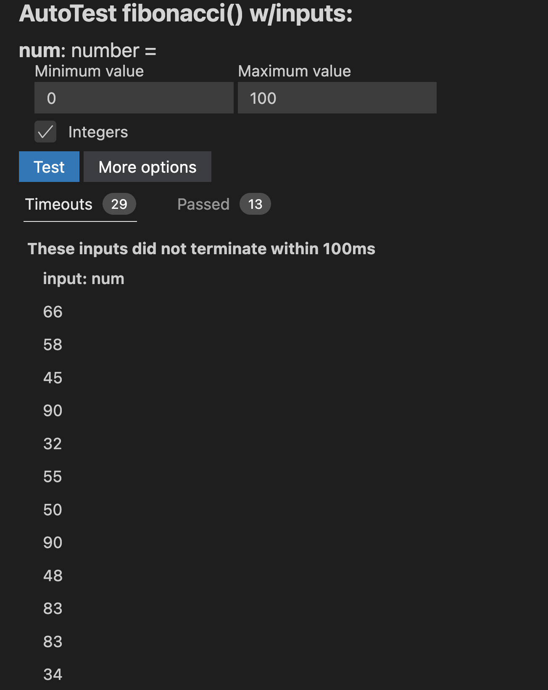

## NaNofuzz tutorial

> NaNofuzz is a useful tool for automatically generating tests for Typescript programs.

To use NaNofuzz, click the `Autotest` button above any Typescript function...

You get a nice UI that allows you to test the function.


> NaNofuzz is a tool for automatically generating tests for functions. NaNofuzz generates random inputs and checks if the function throws an error, times out, or returns NaN, infinity, null or undefined. NaNofuzz can be run directly in VS Code. Above the function name in the program file, there is an option, in white font, that says “fuzz…” This button, when pressed, will create a page with options that ask the programmer to specify ranges for inputs for each argument. After all values have been configured, the user can select “fuzz” to automatically test the function!

Using the same example GCD code from above, we can demonstrate NaNofuzz' functionality. Feel free to follow along to auto-test your function.


At the top of the function name, there is an "Autotest..." button provided for users to begin the testing process. Clicking on that outputs a report for the programmer to specify the range of input values that NaNofuzz can select from.


Here, the range of values for both $a$ and $b$ are 0-100. This means NaNofuzz will generate tests where $a$ and $b$'s values range from 0-100. Once the fuzz button is clicked, NaNofuzz will automatically generate a report.


This then generates a report of all passed and failed tests. Here, we can see the GCD passes for all values ranging from 0-100.

Lets try another function, like fibonacci. 
```Typescript
export function fibonacci(num:number):number {
  if (num <= 1) {
    return 1;
  }
  return fibonacci(num - 1) + fibonacci(num - 2);
}
```
Given a naive implementation of Fibonacci, a novice programmer may not understand time complexity and how poorly this implementation scales with larger inputs. While the implementation is technically correct, we can test just how badly it scales. Running Fibonacci with NaNofuzz, we get the following.



27 iterations of Fibonacci fails due to timeout errors, while 11 pass. The programmer can select the two options to see what values passed and what didn't. 


