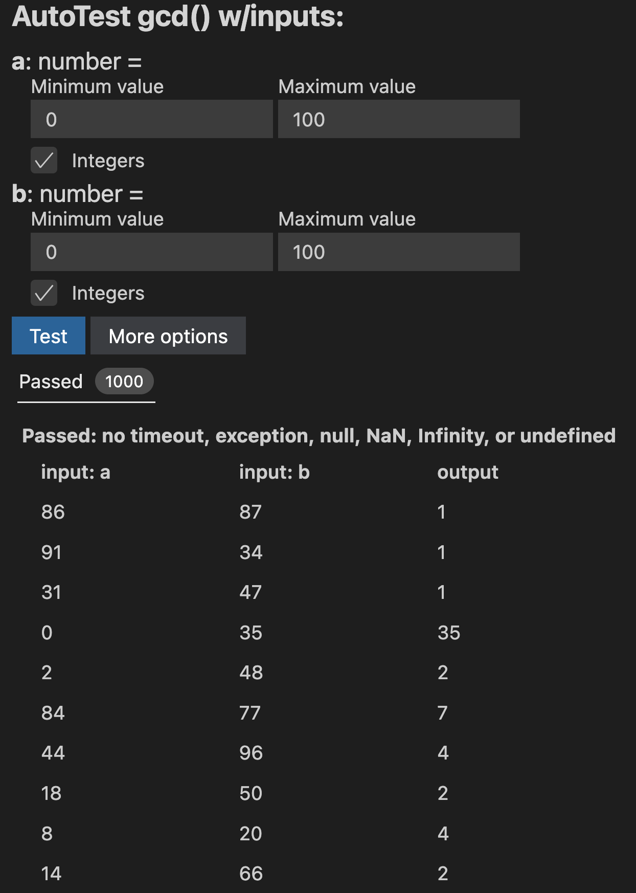

# Tutorials for user study

## Jest Runner tutorial

# ADD SECTION ABOUT FORMATTING TEST CASES
> Jest is a useful tool for running unit tests in Typescript. In a file that contains unit tests, there will be small, white text above each individual test, with the option RUN or DEBUG. By clicking the RUN button, you can run a single test or all tests together. Jest will generate a report in the terminal (it will take a few seconds) after running the tests, with information about which test cases passed and failed. 


This tutorial will demonstrate testing with Jest Runner using the Euclidean algorithm. Feel free to follow along using the provided files, gcd.ts and gcd.test.ts. 

gcd.ts is the file that has the implementation of the Euclidean algorithm in it. 

```Typescript
function gcd(a:number, b:number):number {
  if (b === 0)
    return a;
  else
    return gcd(b, (a % b));
}
```


gcd.test.ts has the test cases to test gcd.ts.

```Typescript
describe("gcdTest", () => {
    test("gcd a", () => {
      expect(gcd(100, 10)).toStrictEqual(10);
    });
  });
```
We want to run Jest to easily generate reports in a compact, intuitive way in the terminal. JestRunner has made it easy to run tests by pressing the run button, instead of manually specifying in the terminal.
In gcd.test.ts you will see this above any test case you are trying to run. 


# PUT THIS AT TOP


If you select the 'Run' button to specifically test for test $a$, it outputs a report in the terminal. Try this for yourself. 


After a few seconds, the output is generated.
As you can see, test $a$ passed, while test $b$ was skipped, since we explicitly commanded the runner to run test A only.

Using this information, you can easily write tests and run them for any function in Typescript.


## NaNofuzz tutorial

> NaNofuzz is a tool for automatically generating tests for functions. NaNofuzz generates random inputs and checks if the function throws an error, times out, or returns NaN, infinity, null or undefined. NaNofuzz can be run directly in VS Code. Above the function name in the program file, there is an option, in white font, that says “fuzz…” This button, when pressed, will create a page with options that ask the programmer to specify ranges for inputs for each argument. After all values have been configured, the user can select “fuzz” to automatically test the function!

Using the same example GCD code from above, we can demonstrate NaNofuzz' functionality. Feel free to follow along to auto-test your function.


At the top of the function name, there is a "Fuzz..." button provided for users to begin the fuzzing process. Clicking on that outputs a report for the programmer to specify the range of input values that NaNofuzz can select from.


Here, the range of values for both $a$ and $b$ are 0-100. This means NaNofuzz will generate tests where $a$ and $b$'s values range from 0-100. Once the fuzz button is clicked, NaNofuzz will automatically generate a report.



This then generates a report of all passed and failed tests. Here, we can see the GCD passes for all values ranging from 0-100.

Lets try another function, like fibonacci. 
```Typescript
export function fibonacci(num:number):number {
  if (num <= 1) {
    return 1;
  }
  return fibonacci(num - 1) + fibonacci(num - 2);
}
```
Given a naive implementation of Fibonacci, a novice programmer may not understand time complexity and how poorly this implementation scales with larger inputs. While the implementation is technically correct, we can test just how badly it scales. Running Fibonacci with NaNofuzz, we get the following.


27 iterations of Fibonacci fails due to timeout errors, while 11 pass. The programmer can select the two options to see what values passed and what didn't. 


